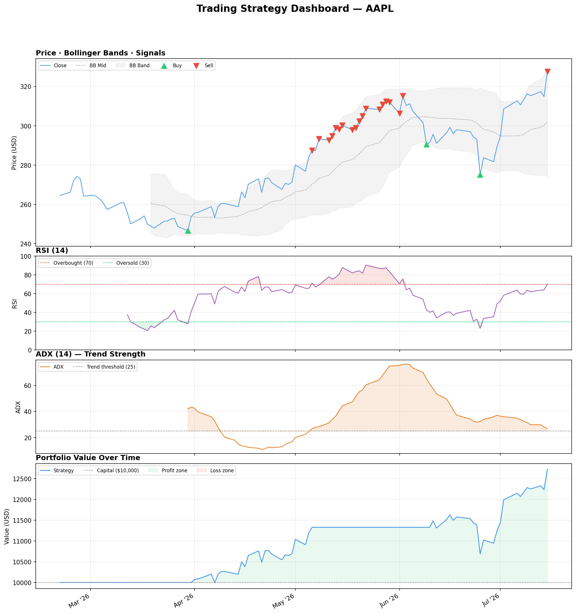

# Stock Trading Strategy — Backtesting Engine

A **production-grade, modular algorithmic trading system** built in Python. Refactored from a flat script into a clean object-oriented architecture with a fault-tolerant data pipeline, deterministic backtesting engine, structured logging, and a full pytest suite.

---

## Architecture Overview

```
├── main.py                  # Entry point
├── config.yaml              # All tunable parameters (no hardcoding)
├── requirements.txt
├── src/
│   ├── strategies/
│   │   ├── base.py          # BaseStrategy — abstract lifecycle (ABC)
│   │   └── technical.py     # TechnicalIndicatorStrategy (RSI + BB + ADX)
│   ├── data/
│   │   └── ingestion.py     # DataIngestionEngine — fault-tolerant API client
│   ├── backtester.py        # Backtester + isolated performance metric functions
│   ├── plotting.py          # 4 Matplotlib charts
│   └── logger.py            # Centralised structured logging
└── tests/
    ├── test_indicators.py   # RSI, BB, ADX, signal correctness
    └── test_backtester.py   # Trade execution & metrics edge cases
```

---

## Technical Indicators

All indicator math is **fully vectorized** using Pandas/NumPy — zero row-level loops.

| Indicator | Purpose |
|---|---|
| **RSI (14)** | Identifies overbought / oversold momentum |
| **Bollinger Bands (20, 2σ)** | Detects price breakouts and mean reversion |
| **ADX (14)** | Filters signals — only trades when trend is strong (ADX > 25) |

---

## Signal Logic

| Signal | Condition |
|---|---|
| **BUY (+1)** | (RSI < 30 OR price < Lower BB) AND ADX > 25 |
| **SELL (-1)** | (RSI > 70 OR price > Upper BB) AND ADX > 25 |
| **HOLD (0)** | No clear trend or no momentum extreme |

---

## Data Pipeline

`DataIngestionEngine` fetches OHLCV data from the **Alpha Vantage REST API** with:
- ⏱ Connection timeout enforcement
- 🔁 Automatic retry with exponential back-off (up to 3 attempts)
- 🚦 HTTP 429 rate-limit detection → 60s pause and retry
- ✅ Malformed / missing JSON payload validation
- 🛑 Typed `DataIngestionError` for clean failure handling

---

## Backtesting Engine

`Backtester` simulates real order execution:
- Tracks **cash** and **position** (shares held) bar-by-bar
- Signals are **shifted by 1 day** to prevent look-ahead bias
- Outputs a structured **trade ledger** (date, action, price, shares, P&L)

### Performance Metrics (isolated, stateless functions)

| Metric | Function |
|---|---|
| Cumulative P&L | `cumulative_return()` |
| Annualised Return | `annualised_return()` |
| Annualised Volatility | `annualised_volatility()` |
| Sharpe Ratio | `sharpe_ratio()` |

---

## Sample Output (Live AAPL — 100 days)

```
=== Trade Ledger ===
      date action   price    shares         pnl
2026-03-31    BUY  253.79  39.40         NaN
2026-05-07   SELL  287.44  39.40    1325.90
2026-06-10    BUY  291.58  38.84         NaN

=== Performance Metrics ===
Total Trades      : 3
Cumulative P&L    : $2173.07
Annual Return     : 52.12%
Annual Volatility : 20.16%
Sharpe Ratio      : 2.59
```

---

## Plots

### Trading Strategy Dashboard
A unified 4-panel dashboard with a shared time axis to visually correlate price action, indicators (RSI, ADX), and portfolio value.


---

## Setup & Run

```bash
pip install -r requirements.txt
python main.py        # runs full pipeline + saves plots to plots/
pytest tests/ -v      # 12 unit tests (~1s, no API calls)
```

---

## Configuration

All parameters are driven by `config.yaml` — no hardcoded values in source:

```yaml
api:
  key: "YOUR_ALPHA_VANTAGE_API_KEY"
  timeout: 10
  max_retries: 3

trading:
  symbol: "AAPL"
  initial_capital: 10000

indicators:
  rsi_period: 14
  bb_period: 20
  bb_std: 2.0
  adx_period: 14
```

---

## Tech Stack

`Python` · `pandas` · `NumPy` · `Matplotlib` · `requests` · `PyYAML` · `pytest`
